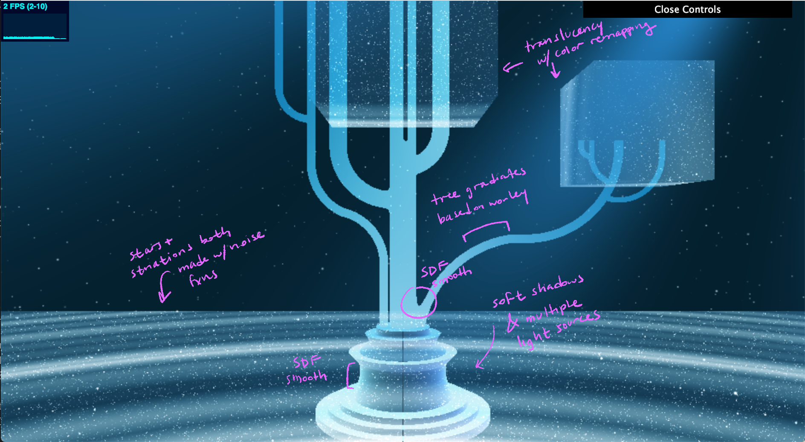
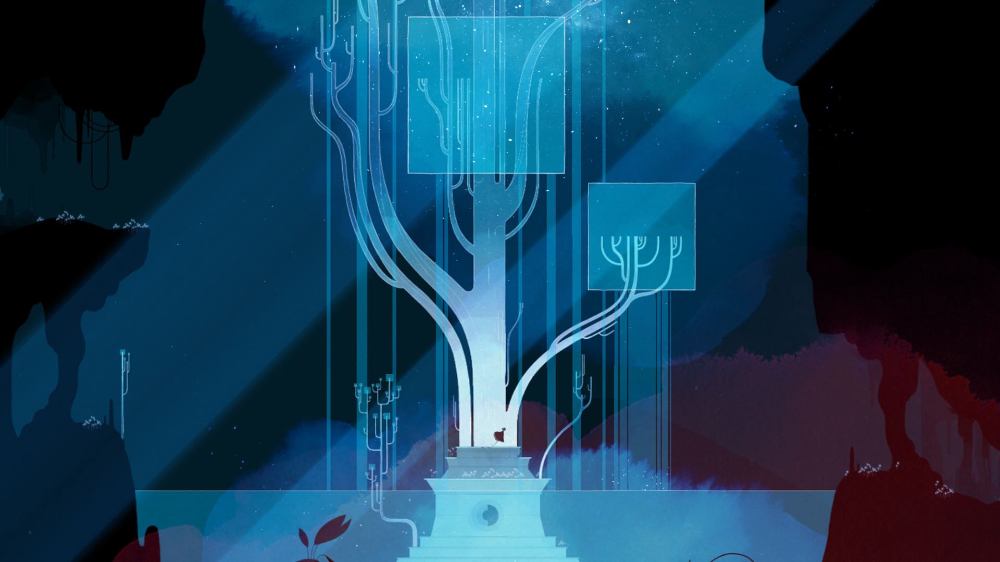

Amy Chen
amyjchen

Live Demo: 

External Resources:
I used my HW2 code as my base code, so any resources used there can also be assumed to have been used here.
ShaderToy: https://www.shadertoy.com/view/MsdcWr
- TRANSLUCENCY EFFECT
TA: https://www.shadertoy.com/view/XdyfR1
- GOD RAYS EFFECT
ShaderToy: https://www.shadertoy.com/view/XtGGRt
- PARTICLES/STARS EFFECT
Adam: https://www.shadertoy.com/view/3djGRc
Adam: https://www.shadertoy.com/view/3sjGz3
- COLOR REMAPPING
TA: https://www.shadertoy.com/view/td2GD3
- MULTIPLE LIGHT SOURCES
iQ's: http://iquilezles.org/www/articles/rmshadows/rmshadows.htm
- SOFT SHADOWS

Annotated Screenshot:

Inspiration (from Gris):

Modeling:
The pedestal is made up of cylinders and capped cones, with some smoothing
The tree is made up of mostly toruses and some cylinders, with elongation and smoothing used to get various curved branch shapes. I used boxes to cut off the toruses so as to only use part of them for the branches.
The water is straightforward, just boxes.

Color Remap of Tree:
Used base code from Adam’s coherent random color palette. Used worley noise combined with time to get a gradient effect on the tree, used animation toolbox function ease in and out.

Lighting:
Using base code of 3-dimensional light, added 4 light sources of different colors and intensities to scene, applied only to pedestal (applying it to the tree as well makes it run extremely slow). Also used iq soft shadows.
God Rays:
Used ShaderToy base code, adjusted frequency/length parameters, positioning, color, and speed of animation.

Water:
Separated the water SDFs into a different rayMarching function, so that I could interpolate between the water color and the final color of the environment to get a translucent effect. Also used color remapping (smoothstepPow) to further adjust the color/effect.
Applied worley noise effect based on ray-marching that gives the water a sort of galaxy/whirlpool look; it directly affects the amount of smoothStep being applied.

Stars:
Used ShaderToy code. Added the star effect heavily where there was water, and lighter everywhere as a more general background.
